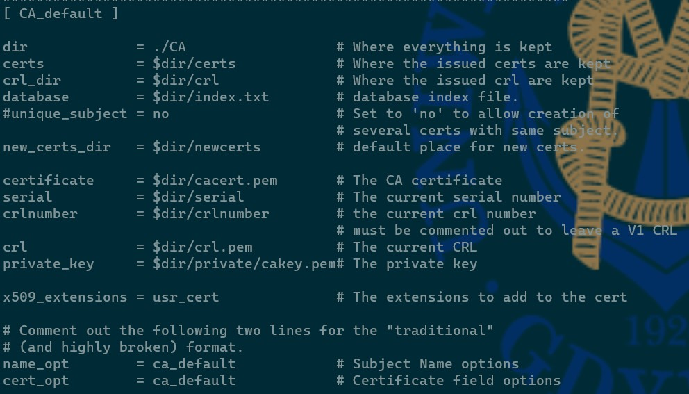

# Tworzenie CA

Pliki potrzebne do stworzenia CA (z pliku /etc/ssl/openssl.cnf)



```bash
more /etc/ssl/openssl.cnf # przejrzenie pliku konfiguracyjnego OpenSSL (przydatne jeżeli się o czymś zapomni / w ramach sprawdzenia)
openssl genrsa -des3 -out ca_klient.key 2048 # wygenerowanie klucza prywatnego dla klienta (2048 bitów, algorytm DES; typp algorytmu i długość może być inna, tak samo nazwa)
openssl req -new -x509 -days 365 -key ca_client.key -out ca_client.crt # wygenerowanie samopodpisanego klucza klucza za pomocą algorytmu X509
openssl genrsa -des3 -out ca_server.key 1024 # wygenerowanie klucza dla serwera
openssl req -new -key ca_server.key -out ca_server.csr # wygenerowanie requesta o podpisanie klucza (w czasie wprowadzanie CommonName trzeba wprowadzić pełny adres serwisu)
 cp ca_klient.key ~/CA/private/ #skopiowanie klucza klienta do pliku
 mv klient.crt ~/CA/signed_cert # przeniesienie wygenerowanego certyfikatu do odpowiedniego folderu
```

Jeżeli wszystko poszło OK, to można wygererowany certyfikat ściągnąć poprzez WinSCP / polecenie SCP na Windowsa i powinien zostać poprawnie rozpoznany

## Przydatne linki

- [Linux Expert](https://linuxexpert.pl/posts/1947/openssl-tworzenie-nowego-certyfikatu/#Dokumentacja_w_sieci) (jest po polsku + dokładnie tłumaczy co robi dana komenda)
- [Arch Linux Wki](https://wiki.archlinux.org/title/OpenSSL) (chaptery 3.1-3.3 (w zależności od wymaganego algorytmu), 3.4,, 3.6, 3.8 )
- [Delicious Brains](https://deliciousbrains.com/ssl-certificate-authority-for-local-https-development/)